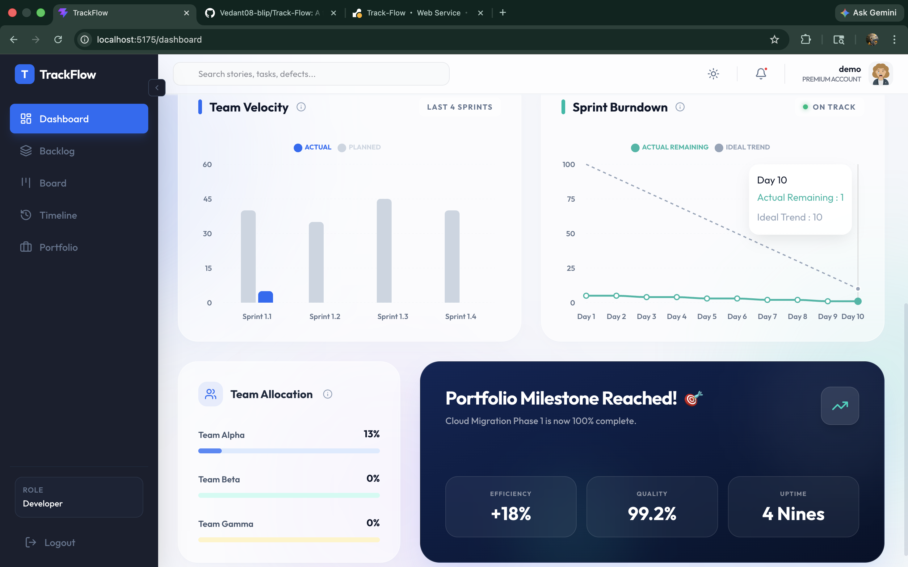
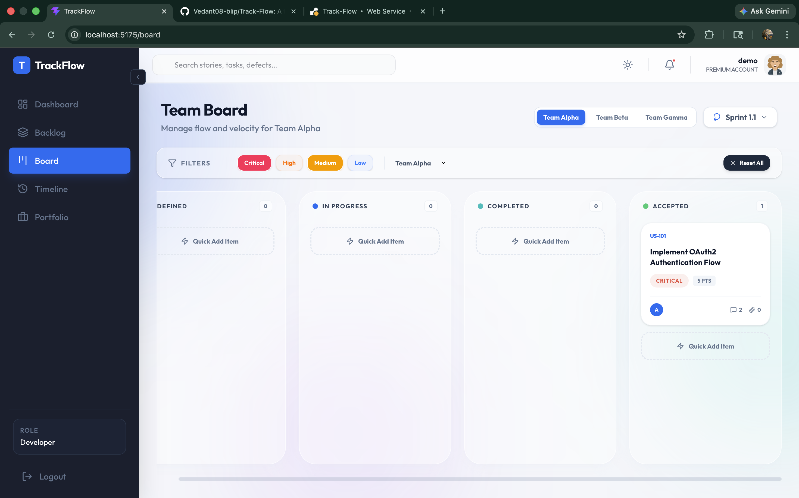

<div align="center">
  
  <h1>TrackFlow</h1>
  <p><b>Elevate your enterprise agile workflow with precision analytics and premium design.</b></p>

  [](https://vitejs.dev/)
  [](https://react.dev/)
  [](https://tailwindcss.com/)
  [](https://www.framer.com/motion/)
</div>

---

## 🚀 Overview

TrackFlow is a high-performance, enterprise-grade Agile management platform designed for modern software teams. It combines the flexibility of Kanban boards with deep analytical insights, allowing leadership and engineering teams to align on velocity, capacity, and portfolio health in real-time.

Built with a **Glassmorphic UI**, TrackFlow offers a premium user experience that feels as good as it functions.

## ✨ Core Features

### 📊 Executive Dashboard
Gain instant insights into your project's heartbeat. Monitor **Team Velocity**, track **Sprint Burndown** in real-time, and oversee **Team Allocation** across your entire portfolio.



### 📋 Interactive Team Board
A fluid, drag-and-drop Kanban environment that provides total transparency on work-in-progress. Filter by priority, team, or status to find exactly what you need.



### 🗓️ Smart Planning & Backlog
- **Backlog Grooming**: Rank and estimate stories with ease.
- **Iteration Planning**: Commit work to sprints based on calculated team capacity.
- **Timeline View**: Visualize your roadmap and milestone progress across quarters.

### 💡 Agile Intelligence
Integrated "App Guide" that demystifies complex agile terminology like Capacity, Velocity, and Burndown directly within the UI.

---

## 🛠️ Technical Stack

- **Framework**: [React 19](https://react.dev/) with [Vite](https://vitejs.dev/)
- **Styling**: [Tailwind CSS](https://tailwindcss.com/)
- **Animations**: [Framer Motion](https://www.framer.com/motion/)
- **Charts**: [Recharts](https://recharts.org/)
- **Icons**: [Lucide React](https://lucide.dev/)
- **Deployment**: Optimized for [Render](https://render.com/)

---

## ⚙️ Getting Started

### Prerequisites
- [Node.js](https://nodejs.org/) (v18 or higher)
- npm or yarn

### Installation

1. **Clone the repository**
   ```bash
   git clone https://github.com/Vedant08-blip/Track-Flow.git
   cd Track-Flow
   ```

2. **Install dependencies**
   ```bash
   npm install
   ```

3. **Start the development server**
   ```bash
   npm run dev
   ```

4. **Build for production**
   ```bash
   npm run build
   ```

---

## 🌐 Deployment on Render

TrackFlow is pre-configured for seamless deployment as a **Web Service** on Render.

> [!IMPORTANT]
> **Required Settings**:
> - **Build Command**: `npm install; npm run build`
> - **Start Command**: `npm run preview`
> - **Environment Variables**: Render automatically injects the `PORT` variable, which our `vite.config.js` is configured to use.

---

## 📂 Project Structure

```text
src/
├── components/   # Reusable UI components & Layouts
├── context/      # Global state management (Project & Auth)
├── pages/        # Main route view components
├── utils/        # Mock data & helper functions
└── styles/       # Global CSS & Tailwind configuration
```

---

<div align="center">
  <p>Built with ❤️ by Vedant Trivedi</p>
</div>
